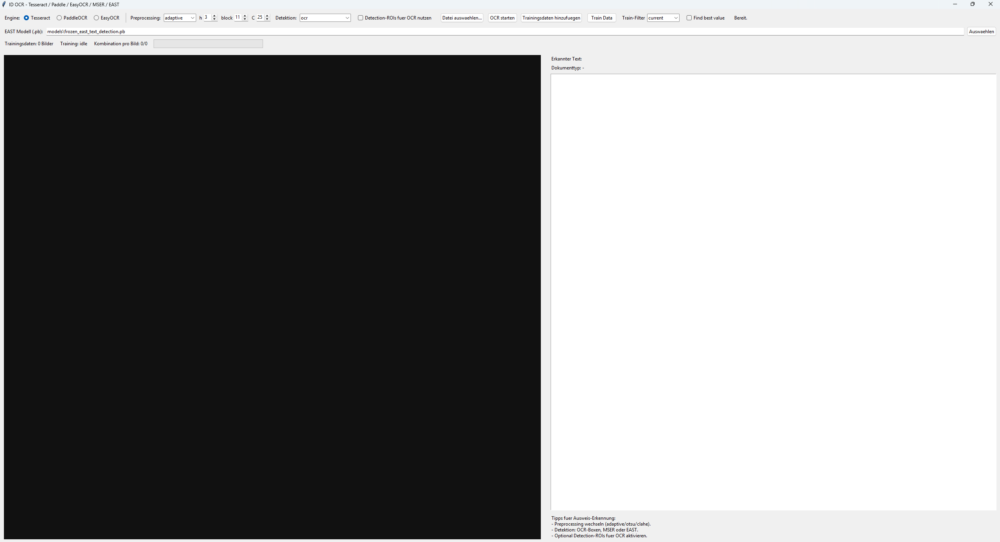
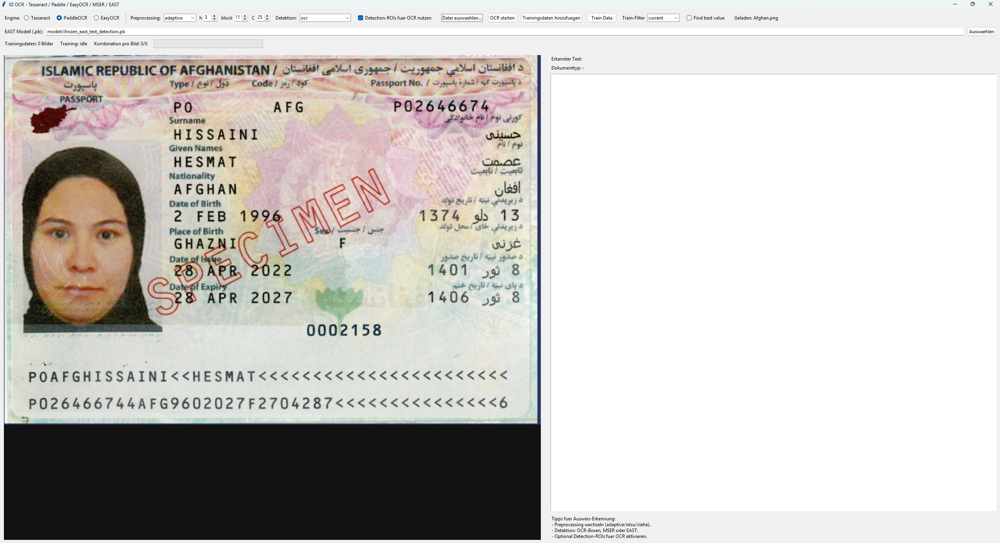
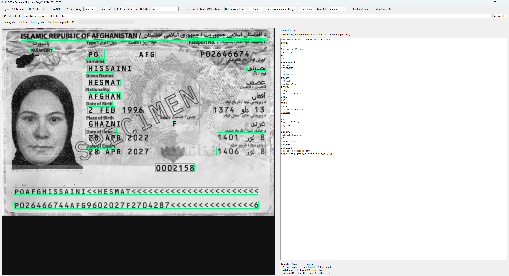
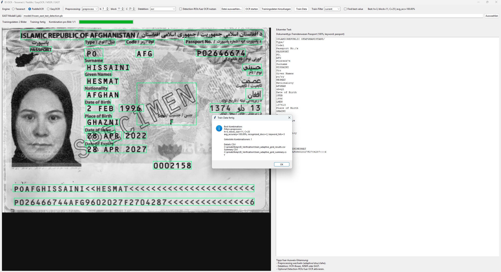

# ID Verification OCR App

Desktop-App (Tkinter) zur OCR-basierten Dokumenterkennung mit:
- `Tesseract`
- `PaddleOCR`
- `EasyOCR`

Zusätzlich enthält die App:
- mehrere Preprocessing-Strategien
- optionale Textdetektion (`OCR-Boxes`, `MSER`, `EAST`)
- Dokumentklassifizierung per `Keyword + Fuzzy Matching`
- Trainings-/Evaluationsmodus für adaptive Parameter

## Features
- Datei laden: Bild/PDF
- OCR-Engine wählbar: `Tesseract`, `PaddleOCR`, `EasyOCR`
- Preprocessing wählbar: `preprocess`, `adaptive`, `otsu`, `clahe`, `none`
- Adaptive Parameter direkt in UI: `h`, `block_size`, `C`
- Textdetektion wählbar: `ocr`, `mser`, `east` (+ Kombis)
- Boxen-Overlay im Bild
- Dokumenttyp-Ausgabe (z. B. `Fremdenpass`, `Aufenthaltstitel`, `Geduldete`, ...)
- Train Data:
  - Mehrfachauswahl von Trainingsbildern
  - Fortschritt + Kombination-pro-Bild Anzeige
  - CSV-Logs mit Detail- und Summary-Daten

## Installation
```powershell
python -m venv .venv
.\.venv\Scripts\python.exe -m pip install --upgrade pip
.\.venv\Scripts\python.exe -m pip install -r requirements.txt
```

## Start
```powershell
.\.venv\Scripts\python.exe .\run.py
```

## Nutzung
1. OCR-Engine auswählen
2. Preprocessing auswählen (bei `adaptive` optional `h/block/C` anpassen)
3. Datei laden
4. `OCR starten`
5. Ergebnistext + Dokumenttyp + Boxen prüfen

## Train Data (adaptive)
- `Trainingsdaten hinzufuegen`: mehrere Bilder auswählen
- `Train-Filter` wählen (`current`, `adaptive`, `preprocess`, `otsu`, `clahe`, `none`)
- `Train Data` starten

Erzeugte Dateien:
- `train_adaptive_grid_results.csv` (Detail pro Bild)
- `train_adaptive_grid_summary.csv` (aggregierte Kombinationen)

Hinweis:
- CSVs werden angehängt (historische Runs bleiben erhalten, unterscheidbar über `run_id`).

## EasyOCR GPU
Aktuell läuft EasyOCR standardmäßig auf CPU.  
Für GPU-Nutzung muss in `ocr_engines.py` der Reader mit `gpu=True` initialisiert werden und eine CUDA-fähige PyTorch-Installation vorhanden sein.

## Screenshot-Platzhalter (für README)
Lege die Bilder unter `docs/images/` ab und nutze diese Namen:

### 1) Allgemeines UI-Bild


### 2) Vergleich / Comparison (z. B. verschiedene Filter)


### 3) Resultbild (OCR + Boxen + Dokumenttyp)


### 4) Trainingsdaten / Train-Data Ansicht


## Projektstruktur
```text
app.py                         # UI + Workflow + Train Data
ocr_engines.py                 # OCR-Engines + Textdetektion
preprocessing.py               # Preprocessing-Pipeline
run.py                         # Startpunkt
requirements.txt               # Python-Abhängigkeiten
train_adaptive_grid_results.csv
train_adaptive_grid_summary.csv
```
